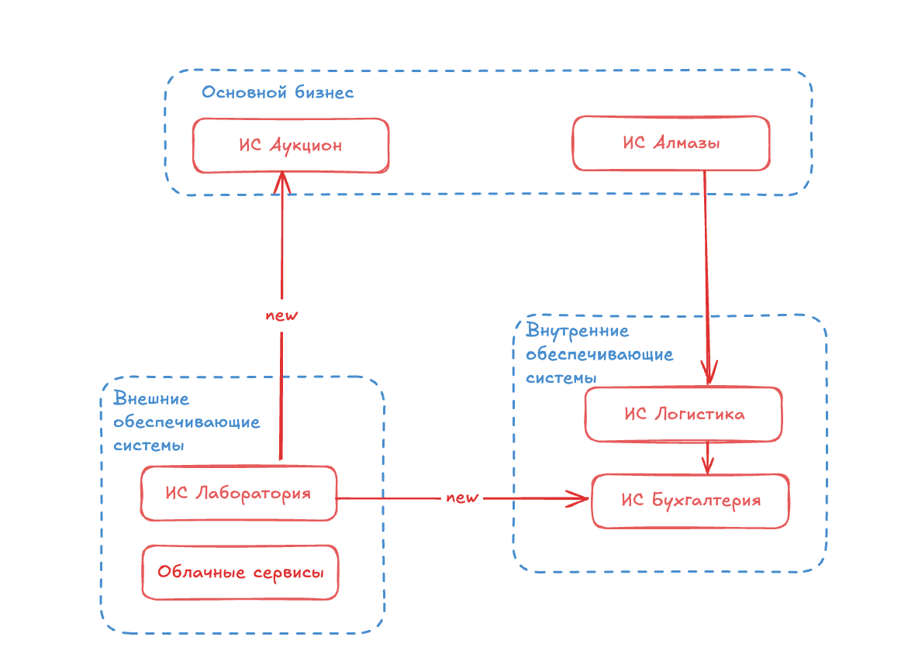

# Архитектурное видение

## Задача

### В чем именно проблема
* Компания «Diamond Universe» должна начать проводить аукционы по продаже алмазов онлайн. Первый онлайн-аукцион должен состояться через 2 месяца. Компания не первый год продаёт алмазы офлайн, у неё для этого есть соответствующие системы. Нужно понять, как переиспользовать имеющиеся системы с минимальными доработками, чтобы успеть провести первый онлайн-аукцион через 2 месяца. Нужно также придумать целевое решение, полностью автоматизирующее процесс продажи алмазов.
* Важным этапом в покупке алмазов является их визуальная оценка. Онлайн формат по качетсву анализа должен не уступать, а возможно даже превосходить текущий способ. Качество анализа влияет на оценку алмаза и, следовательно, на его цену. Чем детальнее покупатель сможет изучить алмаз, тем возможно дороже он сможет за него предложить.

### Кому и чем помогает решение
* Решение помогает покупателям - им не нужно ехать в командировку, чтобы лично оценить качество алмаза. Они могут сделать это опираясь на детальное описание в карточке онлайн-магазин.
* Решение помогает компании «Diamond Universe» продавать алмазы дороже - конкуренция между покупателями за качественные алмазы позволит продавать их за наибольшую цену.

### Важность решения этой задачи
* Многие компания, продающие алмазы, перешли в онлайн ритейл. Если упустить момент и вовремя не перейти на цифровой аукцион, то можно потерять покупателей.

## Контекст
* В первом полугодии 2020 года из-за пандемии объём продаж ювелирных изделий снизился на 15%. После этого компании начали переходить в онлайн и рынок оживился. 
* В компании уже есть системы, которые автоматизируют учет драгоценных камней, автоматизируют проведение аукциона (пока что только офлайн), перевозку камней по стране и за границу.
* Целевое решение должно полностью автоматизировать и отладить процесс подготовки и проведения онлайн-аукциона, снизить риски зависимости от внешних сервисов, конкретных сотрудников, неэффективного использования ресурсов.
* Первый аукцион нужно провести через 2 месяца. Для этого в рамках промежуточного решения нужно:
    - Подготовить вводные для подготовки цифрового аукциона без доработок ИС и интеграций, например, в Excel по утверждённым шаблонам.
    - Использовать имеющиеся информационные системы для планирования, логистики и проведения аукционов.
    - Заключить контракт с провайдером частного облака, чтобы там публиковать данные для клиентов.

## Описание оптимильного решения

### Способы разрешения возникающих вопросов
* Если есть вопросы по продукту, то можно провести интервью с клиентами - нашими покупателями. Также можно посмотреть, как работает у конкурентов.

### Основные этапы проекта
* 
